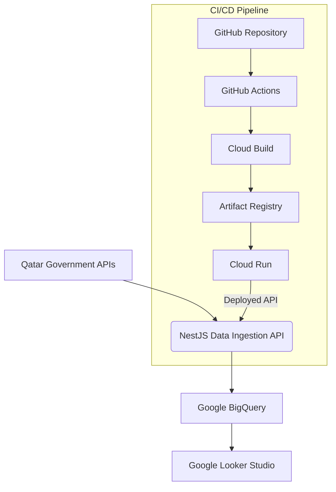

# 🛡️ Insurance Underwriting Risk Dashboard Project

This project demonstrates a comprehensive data pipeline and visualization solution for analyzing **insurance underwriting risk**, using open government data from Qatar.

It includes:

- A **NestJS API** for data ingestion  
- **Google BigQuery** for scalable storage  
- **Google Looker Studio** for interactive dashboarding  
- Fully automated deployment using **Docker**, **GitHub Actions**, **Cloud Build**, and **Cloud Run**

---

 ## Project Overview

The primary goal is to provide insights into various factors influencing underwriting risk, including:

- Real estate market trends  
- Road accident statistics  
- Environmental data (rainfall)  

By integrating these datasets, the dashboard helps insurance underwriters:

- Make more informed decisions  
- Identify high-risk areas  
- Understand correlations between risk indicators  

---

 ## Architecture

The project follows a modern, cloud-native architecture with full CI/CD automation.

## Datasets
1. Real Estate News:
- date_of_contract
- municipality_name
- sm_lbldy
- zone_name
- sm_lmntq
- real_estate_type
- nw_l_qr
- area_in_square_meters
- price_per_square_foot
- real_estate_value
- geo_point_2d (which contains lon and lat)

2. Road Accidents:
- year
- result_of_the_accident
- number_of_people
- result_of_the_accident_ar

4. Rainfall Data (Original Pivoted Format):
- 2016
- 2017
- 2018
- 2019
- 2020
- 2021
- station

Rainfall Data (Transformed Unpivoted Format for Analysis):
- station
- year
 -rainfall_amount

📊 Dashboard Link
The live dashboard is hosted in Looker Studio
https://lookerstudio.google.com/s/kZuIQM6mJaQ

## Deploying to Cloud Build
Enable the below APIs in Google cliud console
- Cloud Build API
- Artifact Registry or Container Registry
- Cloud Run API
- Bigquery API

## CI/CD & Deployment
The NestJS Data Ingestion API is deployed to Google Cloud Run via an automated CI/CD pipeline:
 - Code Push: Changes to the main branch in GitHub trigger the workflow.
- GitHub Actions: Authenticates with GCP using a Service Account Key(stored in project secrets)
- Docker Build & Push: Cloud Build (orchestrated by GitHub Actions) builds the Docker image from the Dockerfile and pushes it to Google Artifact Registry. (steps specified in .github/workflows/deploy.yml)
- Cloud Run Deployment: The image from Artifact Registry is deployed as a new revision to the Cloud Run service. The API is configured to allow unauthenticated invocations for public access. 

## Calling data ingestion API

Make POST request to https://qicunderwritingrisk-205493537479.europe-west1.run.app/ingest
json body {
    "data": "trafficAccidents"
}

pass the data set name to be updates:-> trafficAccidents, realEstate, rainfall

## Future Enhancements
- Error Handling : Implement more robust error handling and retry mechanisms for API calls and BigQuery insertions.
- Data Validation: Add stable data validations (e.g., using NestJS DTOs) for incoming data to ensure it conforms to BigQuery schemas.
- Authentication for API: If the ingestion API needs to be private, implement API key or OAuth2 authentication for the /ingest endpoints.
- Scheduled Ingestion: Use Cloud Scheduler and Cloud Pub/Sub to trigger the NestJS API on a schedule for automated data refreshes.
- Advanced Analytics: Explore BigQuery ML for predictive modeling (e.g., predicting risk scores based on historical data).
- More Data Sources: Integrate additional relevant data (e.g., demographic data, weather forecasts, crime statistics) to enrich risk analysis.

## Challenges 
1. Real Estate News Letter data and rainfall data have been removed

2. Real Estate News Letter API(when it was available) returned paginated response. It had over 20,000 rows. So the offset limit had to be iterated to retrieve all rows. But API threw error when offset limit crossed 10,000.
 
3. Road Accidents risk data lacks the location data. Location data would have been helpful in identifying accident prone areas
4. BigQuery Standard Version showed latency in row insersion probably due to unavailability of compute resources.

